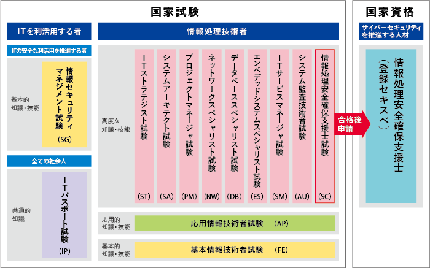

### 取りたい日本のIT資格：
1. [情報セキュリティマネジメント試験(SG)](./SG) 
2. [基本情報技術者試験(FE)](./FE)
3. [応用情報技術者試験(AP)](./AP)
4. [データベーススペシャリスト試験(DB)](./DB)
5. Oracle Certified Java Programmer, Bronze SE
6. AWS Certified Cloud Practitioner

### 試験区分一覧： 

### 試験の概要：
1. [情報セキュリティマネジメント試験(SG)](SG/01_概要.md)
2. [基本情報技術者試験(FE)](FE/01_概要.md)
3. [応用情報技術者試験(AP)](AP/01_概要.md)
4. [データベーススペシャリスト試験(DB)](DB/01_概要.md)

### 試験の分野：
1. [情報セキュリティマネジメント試験(SG)](SG/02_試験分野.md)
2. [基本情報技術者試験(FE)](FE/02_試験分野.md)
3. [応用情報技術者試験(AP)](AP/02_試験分野.md)
4. [データベーススペシャリスト試験(DB)](DB/02_試験分野.md)

> [!NOTE]
> IPA公式HP：https://www.ipa.go.jp/

